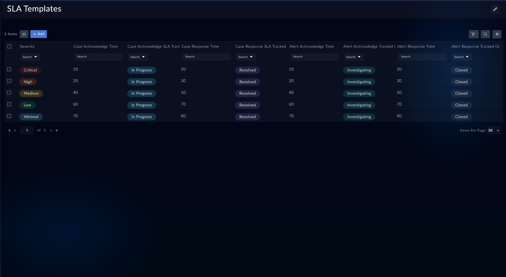
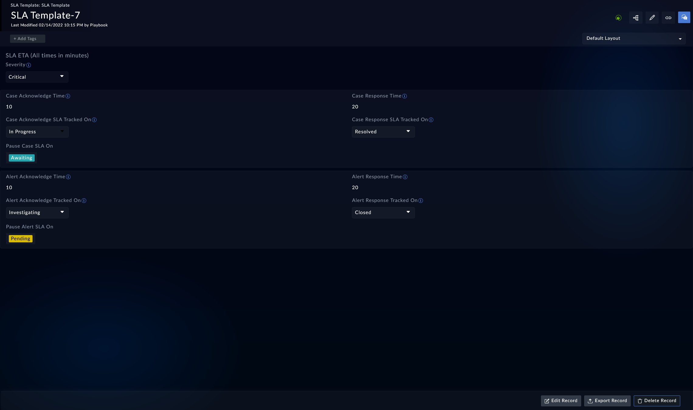
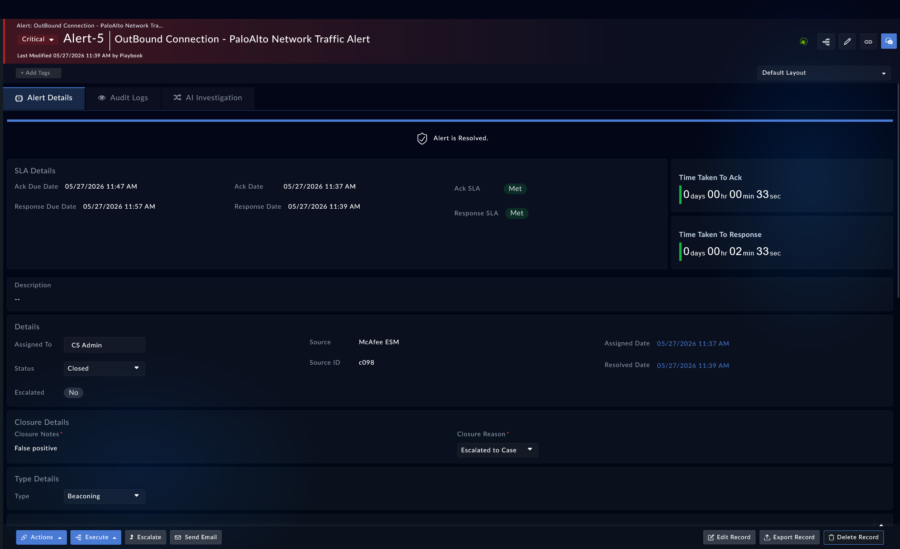

[Home](../README.md) |
| ------------------ |

# Usage

FortiSOAR's **SLA Management** solution pack contains playbooks that automatically track the SLAs of alerts, cases, and other out-of-the-box playbooks for various use cases. The **SLA Calculator** connector calculates the SLA due dates based on the locale and work hours that you have specified.

> [!TIP]
>
> To manage SLA and view an SLA timer on an alert's detail view, install the SLA Management solution pack, **_before_** triggering alert ingestion or creation.

## Working with SLA Templates

The **SLA Management** solution pack contains SLA templates for each severity level defined for cases and alerts. There are templates for the following severity levels:

- Critical
- High
- Medium
- Low
- Minimal

You can set SLAs for both alerts and cases using the same **_SLA Template_**.

To view or edit existing SLA templates:

1. Click <picture><source media="(prefers-color-scheme: dark)" srcset="./res/icon-resources-light.svg"><source media="(prefers-color-scheme: light)" srcset="./res/icon-resources-dark.svg"></picture> **Resources** <picture><source media="(prefers-color-scheme: dark)" srcset="./res/icon-chevron-light.svg"><source media="(prefers-color-scheme: light)" srcset="./res/icon-chevron-dark.svg"></picture> <picture><source media="(prefers-color-scheme: dark)" srcset="./res/icon-sla-management-light.svg"><source media="(prefers-color-scheme: light)" srcset="./res/icon-sla-management-dark.svg"></picture> **SLA Templates** from the left navigation bar.

2. Click an SLA template to view or edit. For example, click **High** to edit SLA parameters for alerts and cases whose severity is set to **_High_**.

    

    Once opened, notice the following:

    - **Pause Case SLA On**/**Pause Alert SLA On**: This field displays the alert and case status that triggers the playbooks to pause the SLA timer.

        Pause SLAs are tracked on change of case status to _`Awaiting`_ and alert status to _`Pending`_.

    - **Case Acknowledge Time**/**Alert Acknowledge Time**: This field displays the time to acknowledge an case or alert and is set to **20** minutes.

        Acknowledgment SLAs are tracked on change of case status to _`In Progress`_ and alert status to _`Investigating`_.
    
    - **Case Response Time**/**Alert Response Time**: This field displays the time to respond to an case or alert and is set to **30** minutes.

        Response SLAs are tracked on change of case status to _`Resolved`_ and alert status to _`Closed`_.

>[!NOTE]
>
>Changes in SLA values are implemented in real time.
>

## Viewing SLAs on a record

You can view the SLA values in the detail-view of an alert or case record. The detail-view displays information such as *Acknowledge Due Date*, *Acknowledge Date*, *Acknowledge SLA*, and *Response Due Date* to track if the SLAs have been met.

1. Click <picture><source media="(prefers-color-scheme: dark)" srcset="./res/icon-resources-light.svg"><source media="(prefers-color-scheme: light)" srcset="./res/icon-resources-dark.svg"></picture> **Resources** <picture><source media="(prefers-color-scheme: dark)" srcset="./res/icon-chevron-light.svg"><source media="(prefers-color-scheme: light)" srcset="./res/icon-chevron-dark.svg"></picture> <picture><source media="(prefers-color-scheme: dark)" srcset="./res/icon-sla-management-light.svg"><source media="(prefers-color-scheme: light)" srcset="./res/icon-sla-management-dark.svg"></picture> **SLA Templates** from the left navigation bar.

2. Select to open an alert record to view the SLA status, i.e., whether they have been met, missed, or awaiting some action.

    The following example image displays an alert with SLA timers. Notice the following:

    - The **Acknowledge SLA** for an alert with **High** severity has been **Met**
    - The response SLA timer is running at 23 minutes 18 seconds
    - The **Response SLA** it is set to **Awaiting Action**
    - The status of this alert is set to **Investigating** which is why the acknowledgment SLA is met
    - Response SLA will change to **Met** or **Missed** depending on when the alert status is set to **Closed** after investigation

# Next Steps
| [Installation](./setup.md#installation) | [Configuration](./setup.md#configuration) | [Contents](./contents.md) |
| --------------------------------------- | ----------------------------------------- | ------------------------- |
